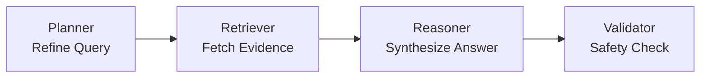
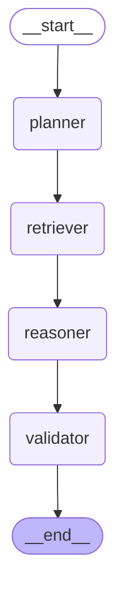

# Clinical Knowledge Assistant: Advanced Technical Documentation

## 1. Project Overview & Objective
This capstone project implements an **Agentic Retrieval-Augmented Generation (RAG)** system designed for clinical decision support. The primary goal is to provide a reliable, grounded interface for querying complex medical datasets (PDFs, Excel clinical trials, CSV patient logs) while minimizing LLM hallucinations through structured AI agent orchestration.

## 2. Technical Architecture & Component Deep-Dive

### 2.1 Agentic Orchestration: LangGraph
Unlike traditional linear RAG, this system uses **LangGraph** to manage a stateful, multi-node workflow. This ensures each query is planned, retrieved, and validated before reaching the user.

#### Workflow Visualization: 


#### Compiled Graph Build (Source-Generated):


#### Agent Node Logic:
- **Planner Node**: Utilizes the LLM to decompose and refine the user's natural language into a technical search query. It acts as a "Query Expansion" layer to improve retrieval recall.
- **Retriever Node**: Interfaces with the **ChromaDB** vector store. It fetches the top-K most relevant document chunks based on cosine similarity of the generated embeddings.
- **Reasoner Node**: The core synthesis engine. It is strictly prompted to use *only* the provided context. If no relevant evidence is found, it is trained to admit a lack of knowledge rather than hallucinate.
- **Validator Node**: A safety guardrail that performs a final check on the response length and relevance to ensure the user receives a high-quality clinical answer.

### 2.2 Data Ingestion & Vector Store
- **Parsing**: Supports `.pdf` (PyPDF), `.txt`, `.csv` (standard CSVLoader), and `.xlsx/.xls` (custom openpyxl logic for sheet-aware tabular parsing).
- **Chunking**: Implements `RecursiveCharacterTextSplitter` with a 1000-character window and 100-character overlap to preserve clinical context across chunk boundaries.
- **Embeddings**: Uses `sentence-transformers/all-MiniLM-L6-v2` (running locally on CPU via HuggingFace), ensuring no external API cost for indexing.
- **Storage**: **ChromaDB** is used as an ephemeral (in-memory) vector store for high-performance retrieval during the session.

## 3. Local Setup & Installation

### 3.1 Prerequisites
- **Python 3.10+**
- **pip** (Python package manager)
- **Google Gemini API Key** (or OpenAI Key)

### 3.2 Installation Steps
1.  **Clone the Repository**:
    ```bash
    git clone <repository-url>
    cd capstone
    ```

2.  **Install Dependencies**:
    ```bash
    pip install -e ".[dev]"
    ```

3.  **Configure Environment Variables**:
    Create a `.env` file in the root directory:
    ```ini
    LLM_PROVIDER=google
    GOOGLE_API_KEY=your_key_here
    EMBEDDING_MODEL=all-MiniLM-L6-v2
    CHUNK_SIZE=1000
    CHUNK_OVERLAP=100
    TOP_K=4
    ```

### 3.3 Running the Application
The app requires both the Backend (FastAPI) and Frontend (Streamlit) to be running:

- **Option A: Unified Script (Recommended)**
    ```bash
    chmod +x run.sh
    ./run.sh
    ```

- **Option B: Manual Start**
    - **Backend**: `uvicorn app.main:app --port 8000`
    - **Frontend**: `streamlit run frontend/app.py`

## 4. Usage Guide

### 4.1 Building the Knowledge Base
1.  Navigate to the **Sidebar** in the Streamlit UI.
2.  Upload your medical documents (e.g., `hypertension_guidelines.pdf`).
3.  Click **"Index Documents"**.
4.  Monitor the **Status** indicator to ensure the RAG Database is "Ready".

### 4.2 Querying the Assistant
- Type questions like *"What are the recommended treatments for Stage 2 Hypertension?"*
- **Verify Evidence**: Expand the **"Sources"** toggle under each response to see exactly which document and page the AI used.
- **Inspect Logic**: Open the **"Agent reasoning trace"** to see how the Planner refined your query and how the Retriever selected the evidence.

### 4.3 Database Management
- Use **"Clear chat history"** (sidebar) to start a fresh conversation.
- Use **"Truncate & Rebuild RAG DB"** (sidebar) to wipe the vector store and upload new documents for a different clinical case.

## 5. Compliance with Capstone Tasks
This system fully implements the 10 mandated tasks, including **Intelligent Document Retrieval (Task 6)**, **Agent-based Reasoning (Task 8)**, and **Reliability/Safety Controls (Task 9)** via the LangGraph Validator node and RAG state gating.
