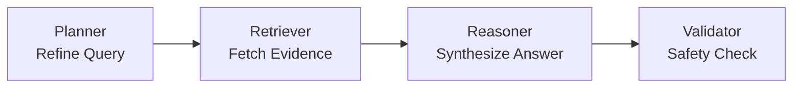

# Agentic RAG · Clinical Knowledge Assistant

A Generative AI–powered application that enables users to query enterprise documents using autonomous AI agents. Upload PDF, TXT, CSV, or Excel files and ask natural language questions — the system retrieves relevant content via a vector database and generates grounded answers via an LLM.

---

## Architecture

```
frontend/app.py  (Streamlit UI)
      │  HTTP
      ▼
app/main.py      (FastAPI)
      ├─ POST /api/v1/documents/upload
      ├─ GET  /api/v1/documents
      ├─ DELETE /api/v1/documents/{id}
      └─ POST /api/v1/chat
               │
               ▼
         LangGraph Agent
           planner → retriever → reasoner → validator
                         │
                    ChromaDB (in-memory)
                    HuggingFace Embeddings
```

## Project Structure

```
capstone/
├── app/
│   ├── main.py               # FastAPI entry point
│   ├── config.py             # Settings via pydantic-settings
│   ├── models/schemas.py     # Pydantic request/response models
│   ├── core/
│   │   ├── ingestion.py      # PDF/TXT/CSV/Excel loaders + chunking
│   │   ├── vector_store.py   # ChromaDB in-memory singleton
│   │   └── agent.py          # LangGraph agent pipeline
│   └── api/routes/
│       ├── documents.py      # Upload / list / delete
│       ├── chat.py           # Chat endpoint
│       └── health.py         # Health check
├── frontend/
│   ├── app.py                # Streamlit chat UI
│   └── api_client.py         # httpx wrapper
├── .env.example
└── pyproject.toml
```

## Setup

### 1. Install dependencies

```bash
pip install -e ".[dev]"
```

### 2. Configure environment

```bash
cp .env.example .env
# Edit .env and set GOOGLE_API_KEY (or OPENAI_API_KEY + LLM_PROVIDER=openai)
```

### 3. Run the backend

```bash
uvicorn app.main:app --host 0.0.0.0 --port 8000 --reload
```

API docs available at: http://localhost:8000/docs

### 4. Run the frontend

```bash
streamlit run frontend/app.py
```

Open browser at: http://localhost:8501

---

## Agent Pipeline



| Step | Node | Role |
|------|------|------|
| 1 | **Planner** | Reformulates the question for better retrieval; detects greetings |
| 2 | **Retriever** | Fetches top-K relevant chunks from ChromaDB via semantic search |
| 3 | **Reasoner** | Generates a grounded answer using the LLM + retrieved context only |
| 4 | **Validator** | Applies safety fallback; prevents empty or hallucinated responses |

## Supported Formats

| Format | Extension |
|--------|-----------|
| PDF | `.pdf` |
| Plain text | `.txt` |
| CSV | `.csv` |
| Excel | `.xlsx`, `.xls` |

## API Endpoints

| Method | Path | Description |
|--------|------|-------------|
| `GET` | `/api/v1/health` | Health check + stats |
| `POST` | `/api/v1/documents/upload` | Upload & index a document |
| `GET` | `/api/v1/documents` | List indexed documents |
| `DELETE` | `/api/v1/documents/{doc_id}` | Remove a document |
| `POST` | `/api/v1/chat` | Ask a question |

## Limitations

- Vector store is **in-memory** — documents are lost on server restart.
- No multi-turn conversation memory (each question is independent).
- LLM quality depends on the configured provider and model.
